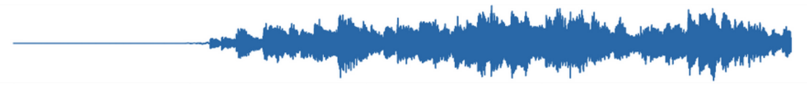
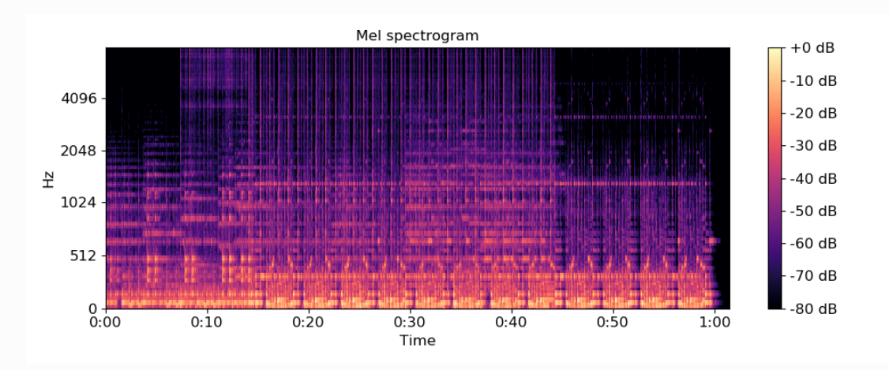
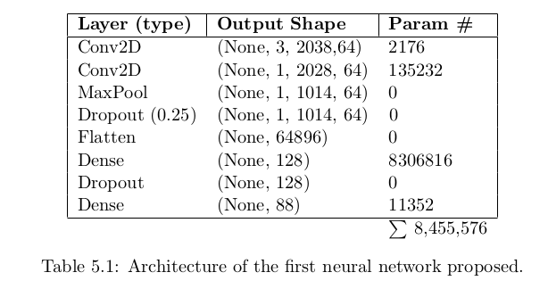
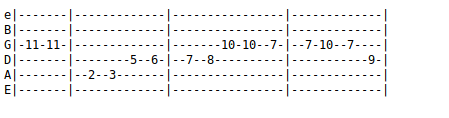

# Tab_Generator 

Tab generator is an automatic music transcription program that generates guitar tablature from audio files.  
The guitar Tab Generator runs as a Flask web application and is hosted on AWS.  The url is http://guitartabgen.com/

The data I used for training my models was found at https://github.com/marl/GuitarSet.  

Tab_Generator makes uses of the librosa library for its music information retrieval (MIR) functionality, as well as Keras for the Neural Networks I experimented with.  I used an AWS EC2 instance to train the network using their deep learning AMI.

The program is able to generate guitar tablature from raw audio wav files.  I began by doing monophonic transcription with simple signal processing and the use of librosa's onset detection functions.  I then moved on to using Keras and trained neural networks with the input "X" data being spectograms, and the target variable being a 48 dimensional vector (12 * 4) notes for four octaves. 

Below is a visualization of a songs waveform.  The input of the program is a simple WAV file, a simple uncompressed audio format that is an array of numbers representing the waveform of the signal.  

Using librosa, I was able to create and visualize spectograms, which were used as inputs to the neural networks.  I experimented both with the stft and the constant q transform cqt (a variation of the fourier transform where the frequencies have been scaled by a logarithmic factor which alligns with our perception of pitch and thus is useful when performing music information retrieval) to generate the spectograms.   

Here is the neural network architcture that I experimented with first.  I found this architecture being used by Manuel Minguez Carretero in his final thesis, where he performed the same analysis on the MusicNet piano data set for music information retrieval.  

Here is the output tablature created using monophonic transcription.  I am working still working on the polyphonic transcription.

